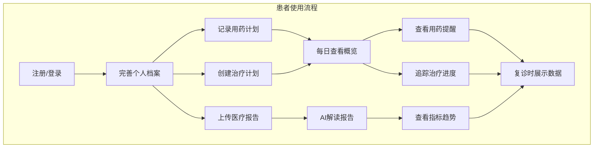
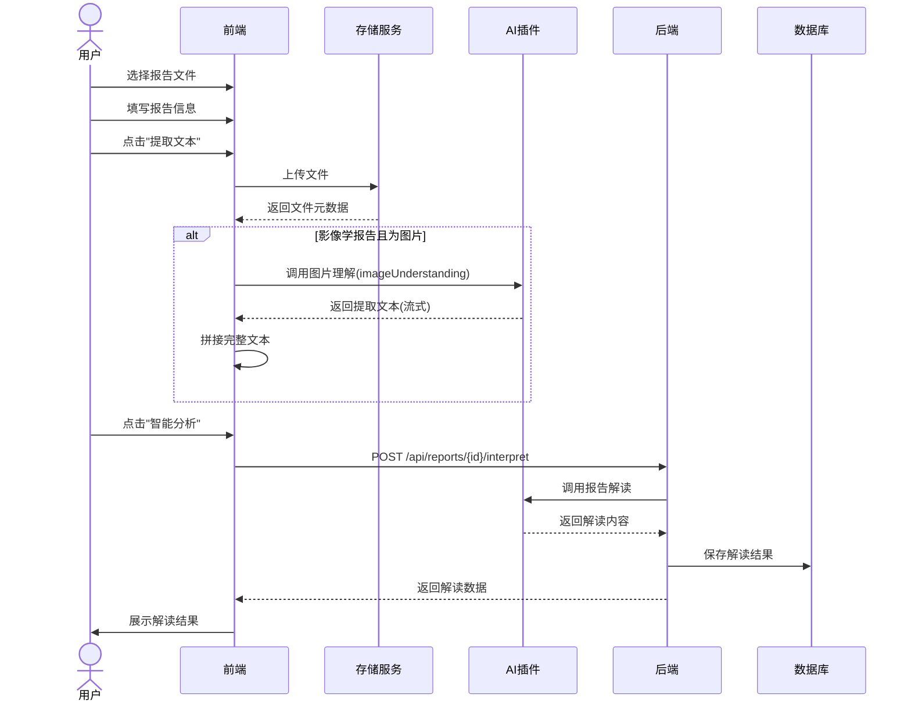
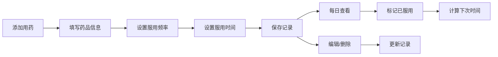
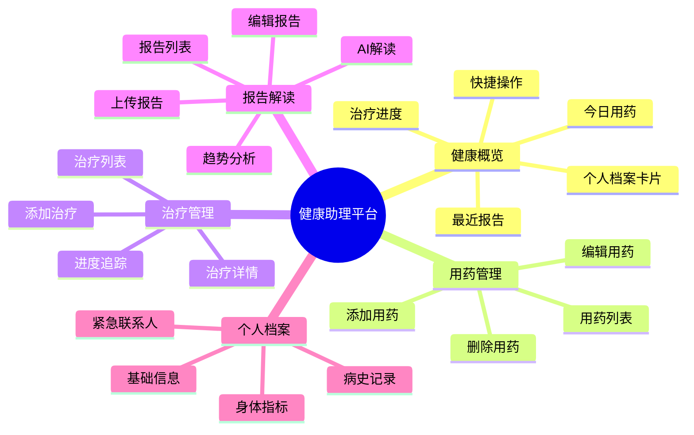
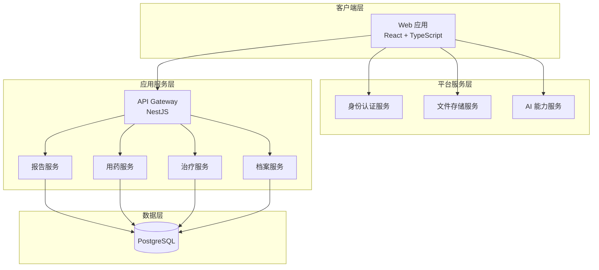
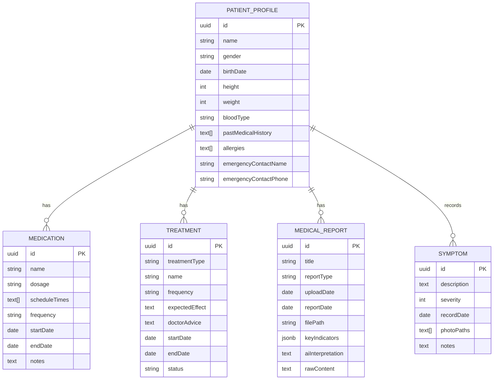
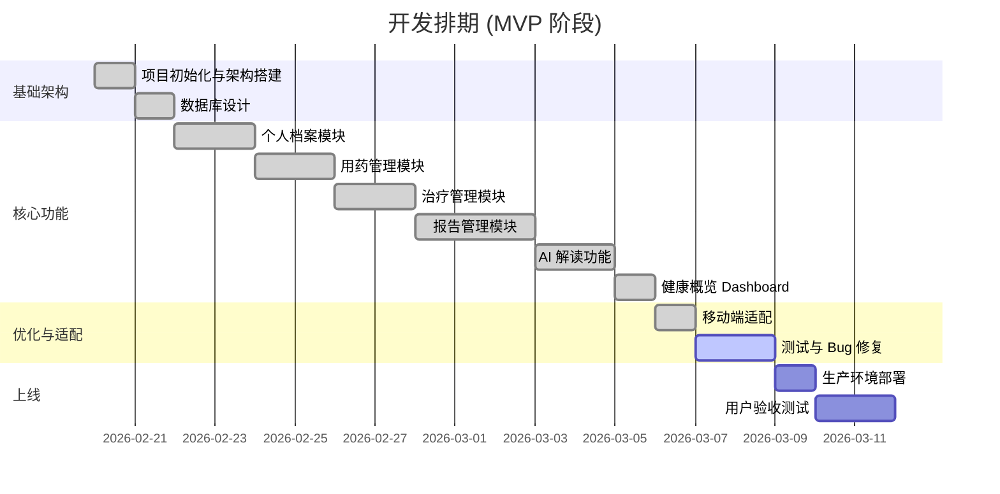

# 癌症患者健康助理平台 - 产品需求文档 (PRD)

---

## 0. 文档信息

### 0.1 版本信息

| 项目 | 内容 |
|------|------|
| 文档版本 | v1.0.0 |
| 产品版本 | v1.0.0 (MVP) |
| 文档状态 | 已完成 |
| 所属阶段 | MVP 阶段 |

### 0.2 更新记录

| 版本 | 日期 | 更新内容 | 作者 |
|------|------|----------|------|
| v1.0.0 | 2026-02-24 | 初始版本，包含健康概览、用药管理、治疗管理、报告解读四大核心模块 | 李室家主 |

### 0.3 文档说明

本文档为癌症患者健康助理平台的初代产品需求文档，定义了 MVP 阶段的核心功能范围与实现方案。

---

## 1. 需求背景与目标

### 1.1 项目概述

**产品名称：** 癌症患者健康助理平台  
**产品定位：** 面向癌症患者的个人健康管理助手  
**目标用户：** 正在接受治疗的癌症患者及其家属

癌症患者在接受治疗期间需要管理大量复杂的医疗信息：
- 多种药物的服用时间和剂量
- 定期治疗（化疗、放疗等）的安排
- 各类医疗检查报告的整理与解读
- 症状变化的记录与追踪
- 医患沟通时的信息快速查阅

本产品旨在通过数字化手段帮助患者高效管理治疗全流程，降低信息管理负担，提升治疗依从性。

### 1.2 核心问题

| 问题编号 | 问题描述 | 影响程度 |
|----------|----------|----------|
| P1 | 用药信息混乱：患者常需同时服用多种药物，容易忘记服药时间或剂量 | 高 |
| P2 | 治疗进度不透明：无法直观了解当前治疗阶段的完成情况 | 中 |
| P3 | 医疗报告难理解：专业术语晦涩，患者难以理解报告含义 | 高 |
| P4 | 信息分散：检查报告、病历资料分散各处，复诊时难以快速查找 | 中 |
| P5 | 症状记录缺失：治疗期间的身体变化缺乏系统记录，影响医生判断 | 中 |

### 1.3 用户故事

#### 用户画像 1：化疗期患者张女士
- **年龄**：52岁
- **病情**：乳腺癌术后化疗期
- **痛点**：每次化疗后需要服用多种辅助药物，经常忘记服药时间
- **使用场景**：每天早上查看今日用药清单，标记已服用的药物

#### 用户画像 2：患者家属李先生
- **年龄**：45岁
- **身份**：肺癌患者家属
- **痛点**：带父亲复诊时需要携带大量纸质报告，经常遗漏
- **使用场景**：上传父亲的 CT 报告，通过 AI 解读快速了解病情变化

#### 用户画像 3：康复期患者王先生
- **年龄**：60岁
- **病情**：结直肠癌术后康复期
- **痛点**：需要长期跟踪复查指标的变化趋势
- **使用场景**：查看历次血液检查的关键指标趋势图

### 1.4 需求范围管理

#### 1.4.1 包含范围 (In Scope)

| 模块 | 功能范围 |
|------|----------|
| 健康概览 | 今日用药提醒、治疗进度展示、快捷操作入口、最近报告预览 |
| 用药管理 | 用药记录 CRUD、用药状态追踪、下次服药时间提醒 |
| 治疗管理 | 治疗计划 CRUD、治疗进度可视化、治疗详情查看 |
| 报告管理 | 报告上传（PDF/图片）、AI 智能解读、关键指标提取、趋势分析 |
| 个人档案 | 基础信息管理、病史记录、紧急联系人 |

#### 1.4.2 不包含范围 (Out of Scope)

| 功能 | 说明 | 计划版本 |
|------|------|----------|
| 症状记录模块 | 完整的症状追踪与图表分析 | v1.1 |
| 提醒通知系统 | 用药/治疗提醒的推送通知 | v1.1 |
| 医生端功能 | 医生查看患者数据的协作功能 | v2.0 |
| 数据导出 | 报告导出为 PDF/Excel | v1.2 |
| 多患者管理 | 一个账号管理多位患者 | v2.0 |

### 1.5 需求列表与优先级

| 优先级 | 需求编号 | 需求名称 | 所属模块 | 用户价值 | 实现复杂度 |
|--------|----------|----------|----------|----------|------------|
| P0 | R001 | 用药记录管理 | 用药管理 | 解决核心痛点 | 低 |
| P0 | R002 | 治疗计划管理 | 治疗管理 | 解决核心痛点 | 低 |
| P0 | R003 | 医疗报告上传与存储 | 报告管理 | 解决核心痛点 | 中 |
| P0 | R004 | AI 报告解读 | 报告管理 | 差异化竞争力 | 中 |
| P0 | R005 | 健康概览 Dashboard | 健康概览 | 统一入口 | 低 |
| P1 | R006 | 个人健康档案 | 个人中心 | 基础信息支撑 | 低 |
| P1 | R007 | 关键指标趋势分析 | 报告管理 | 数据价值挖掘 | 中 |
| P1 | R008 | 报告文本智能提取 | 报告管理 | 提升使用效率 | 中 |
| P2 | R009 | 移动端适配 | 全局 | 使用场景扩展 | 中 |
| P2 | R010 | 治疗进度可视化 | 治疗管理 | 体验优化 | 低 |

---

## 2. 方案概述

### 2.1 业务流程



### 2.2 功能流程

#### 2.2.1 报告上传与解读流程



#### 2.2.2 用药管理流程



### 2.3 信息架构



### 2.4 系统架构



---

## 3. 细节方案

### 3.1 页面原型与交互说明

#### 3.1.1 布局结构

**桌面端布局：**
```
+------------------+---------------------------+
|                  |                           |
|    侧边导航栏     |      主内容区域            |
|   (240px固定)    |      (自适应剩余宽度)       |
|                  |                           |
|  - 健康概览       |                           |
|  - 用药管理       |                           |
|  - 治疗管理       |                           |
|  - 报告解读       |                           |
|                  |                           |
+------------------+---------------------------+
```

**移动端布局：**
```
+------------------+
|  顶部标题栏 菜单  |
+------------------+
|                  |
|   主内容区域      |
|                  |
|                  |
|                  |
+------------------+
| 概览 用药 治疗 报告|  <- 底部导航
+------------------+
```

#### 3.1.2 健康概览页 (Dashboard)

**页面结构：**
1. **Hero 区域**：欢迎语 + 健康状态图标
2. **个人档案卡片**：基本信息、身体指标（BMI、血型等）、病史摘要
3. **快捷操作区**：记录用药、添加治疗、上传报告
4. **今日用药卡片**：今日需服用的药物列表
5. **治疗进度卡片**：进行中治疗的进度条
6. **最近报告**：最近上传的 3-5 份报告

**交互说明：**
- 点击档案卡片的"编辑"按钮 → 弹出编辑表单
- 点击快捷操作按钮 → 跳转到对应页面
- 点击用药项 → 标记为已服用（TBD）
- 点击报告项 → 查看报告详情

#### 3.1.3 用药管理页

**页面结构：**
1. **页面头部**：标题 + 添加按钮
2. **用药列表**：卡片式布局，每项显示：
   - 药品名称 + 状态标签
   - 剂量 + 频率
   - 下次服药时间
   - 操作菜单（编辑/删除）

**状态标签：**
- 进行中（绿色）
- 未开始（灰色）
- 已结束（灰色）

**空状态：**
- 显示药品图标 + "暂无用药记录" + "点击添加用药创建您的第一条记录"

#### 3.1.4 治疗管理页

**页面结构：**
1. **页面头部**：标题 + 添加按钮
2. **治疗列表**：卡片式布局，每项显示：
   - 治疗名称 + 状态标签
   - 治疗类型
   - 起止日期
   - 进度条 + 百分比
   - 操作菜单

**状态标签：**
- 进行中（绿色）
- 已暂停（橙色）
- 已完成（灰色）

**交互说明：**
- 点击卡片 → 查看治疗详情（侧边抽屉或弹窗）
- 详情页展示：医生嘱托、预期效果、完整进度

#### 3.1.5 报告解读页

**页面结构：**
1. **页面头部**：标题 + 上传按钮
2. **报告列表**：卡片式布局，每项显示：
   - 报告标题 + 类型标签（CT/MRI/血液等）
   - 报告日期
   - 关键指标预览（最多3个）
   - "已解读"标签（如有）
   - 操作按钮：智能分析/查看分析 + 更多菜单

**上传流程：**
1. 点击上传按钮 → 打开上传对话框
2. 拖拽或选择文件（PDF/JPG/PNG）
3. 填写报告名称、类型、报告日期
4. 点击"提取报告文本"（仅影像学图片报告）
5. 等待 AI 提取文本
6. 点击"确认上传"

**AI 解读流程：**
1. 点击"智能分析"按钮
2. 显示加载状态
3. 展示解读结果：
   - 通俗化解读（卡片式布局）
   - 关键要点列表
   - 健康建议

**趋势分析：**
- 点击"趋势分析"按钮 → 弹出对话框
- 选择指标类型（白细胞、红细胞等）
- 展示折线图：历次检查的指标变化
- 支持切换时间范围

### 3.2 数据模型

#### 3.2.1 核心实体关系



### 3.3 边缘情况处理

| 场景 | 处理方案 |
|------|----------|
| 网络中断 | 操作失败时显示重试按钮；上传过程中断可重新上传 |
| 文件上传失败 | 显示具体错误信息（格式不支持/超出大小限制） |
| AI 解读超时 | 显示"解读超时，请稍后重试" |
| AI 解读失败 | 允许手动上传不解读，或稍后重试 |
| 无网络时打开页面 | 显示离线提示，缓存上次数据（TBD） |
| 重复上传相同报告 | 不做重复校验，允许重复上传（用户可能有多次检查） |
| 用药时间冲突 | 不做冲突校验，由用户自行管理 |
| 删除正在进行的用药/治疗 | 二次确认弹窗，确认后删除 |
| 报告文件丢失 | 列表中保留记录，点击查看时提示"文件已失效" |

### 3.4 非功能需求

#### 3.4.1 性能需求

| 指标 | 目标值 |
|------|--------|
| 页面首屏加载时间 | < 2s |
| API 响应时间 (P95) | < 500ms |
| 文件上传速度 | > 1MB/s |
| AI 解读响应时间 | < 10s |

#### 3.4.2 兼容性需求

| 平台 | 支持版本 |
|------|----------|
| Chrome | 最新 2 个版本 |
| Safari | 最新 2 个版本 |
| Firefox | 最新 2 个版本 |
| 微信内置浏览器 | 支持 |
| iOS Safari | iOS 14+ |
| Android Chrome | Android 10+ |

#### 3.4.3 安全需求

- 用户数据隔离：患者只能查看和修改自己的数据
- 文件访问控制：上传的报告文件通过鉴权链接访问
- 敏感信息保护：紧急联系人等敏感信息加密存储（TBD）

#### 3.4.4 可用性需求

- 响应式设计：适配桌面端和移动端
- 无障碍支持：按钮和链接有明确的焦点状态
- 错误提示：所有错误操作有明确的文字提示
- 加载状态：异步操作显示加载指示器

---

## 4. 上线计划

### 4.1 项目排期



### 4.2 里程碑计划

| 里程碑 | 预计日期 | 交付物 | 状态 |
|--------|----------|--------|------|
| M1 - 架构完成 | 2026-02-21 | 项目框架、数据库设计 | 已完成 |
| M2 - 核心功能 | 2026-02-28 | 四大核心模块可用 | 已完成 |
| M3 - MVP 完成 | 2026-03-05 | 移动端适配、Bug 修复完成 | 进行中 |
| M4 - 正式上线 | 2026-03-10 | 生产环境部署、UAT 通过 | 计划中 |

### 4.3 发布 checklist

**上线前准备：**
- [ ] 生产环境数据库迁移
- [ ] 生产环境存储桶配置
- [ ] AI 插件生产环境授权
- [ ] 域名与 SSL 证书配置
- [ ] 监控与日志系统配置

**功能验收：**
- [ ] 用户注册/登录流程正常
- [ ] 个人档案 CRUD 正常
- [ ] 用药记录 CRUD 正常
- [ ] 治疗记录 CRUD 正常
- [ ] 报告上传正常
- [ ] AI 解读功能正常
- [ ] 移动端页面显示正常

**性能验收：**
- [ ] 首屏加载时间 < 2s
- [ ] API 响应时间 < 500ms
- [ ] 并发用户支持 > 100

### 4.4 运营计划

| 阶段 | 时间 | 目标 | 策略 |
|------|------|------|------|
| 冷启动 | 上线第 1-2 周 | 种子用户 10 人 | 邀请内部员工及家属试用 |
| 内测期 | 上线第 3-4 周 | 内测用户 50 人 | 医院肿瘤科患者招募 |
| 公测期 | 上线第 2 月 | 活跃用户 200 人 | 患者社群推广 |
| 稳定期 | 上线第 3 月 | 活跃用户 500 人 | 口碑传播 + 医生推荐 |

### 4.5 风险预案

| 风险 | 影响 | 应对措施 |
|------|------|----------|
| AI 解读准确率不高 | 高 | 增加"仅供参考，以医生诊断为准"提示；建立用户反馈机制 |
| 用户数据安全意识不足 | 中 | 增加隐私政策说明；提供数据删除功能 |
| 老年用户使用困难 | 中 | 准备图文使用教程；考虑推出简化版界面 |
| 服务器性能瓶颈 | 中 | 上线前进行压力测试；准备扩容方案 |

---

## 附录

### A. 术语表

| 术语 | 解释 |
|------|------|
| CT | 计算机断层扫描 |
| MRI | 核磁共振成像 |
| BMI | 身体质量指数 |
| MVP | 最小可行产品 |
| CRUD | 创建、读取、更新、删除 |

### B. 参考资料

- [TBD] 用户调研报告
- [TBD] 竞品分析报告
- [TBD] 医疗数据安全规范

---

*文档结束*
